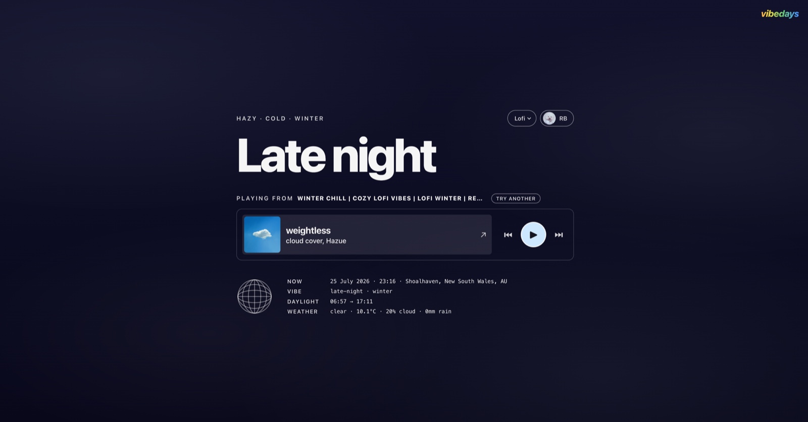

# Vibedays

Music that fits your day.



A static web player that reads the sun and the weather where you are, then finds
a playlist on Spotify to match. When the day changes, so does the music.

At 6pm on a clear winter evening it plays something calm and unwinding. At 2am it
plays something ambient. When it starts raining it changes again. Nobody picks
the playlists, and there is nothing to configure beyond signing in.

Pick a genre (lofi, synthwave, jazz, classical or ambient) and the whole system
follows it.

No backend, no database, no API keys. It runs entirely in the browser.

## What you need

- **Spotify Premium.** Playback uses the Web Playback SDK, which does not work on
  free accounts. This applies to everyone who uses your copy, not just you.
- **Node 18 or newer.**
- **A Spotify app**, free to create. See below.

## Read this before you plan anything public

Spotify apps start in **development mode**, which allows **5 named accounts**.
Every person who signs in has to be added by email in the dashboard first.
Anyone else gets a 403 and cannot use the app at all.

Lifting that needs **extended quota mode**, and since May 2025 the criteria are a
registered business entity, a launched service, and at least 250,000 monthly
active users. There is no tier in between.

So a hosted instance anyone can sign into is not possible with Spotify. What
works is this: **each person runs their own copy with their own Spotify app**,
and gets their own five accounts. That is why the Client ID is an environment
variable rather than committed.

If you want a genuinely public hosted app, the music provider has to change. The
conditions engine knows nothing about Spotify, so it is a contained job:
everything Spotify-specific lives in `src/spotify/`.

### Adding people

Dashboard, your app, **Settings**, then **User Management**. Add a name and the
email address on their Spotify account, which is not always the address they
normally use; they can check it at
[spotify.com/account](https://www.spotify.com/account).

You are one of the five automatically, as the app owner. If the account you use
day to day is not the one that created the app, it takes one of the other four.

## Setup

**1. Clone and install**

```bash
git clone https://github.com/rokublac/vibedays.git
cd vibedays
npm install
```

**2. Create a Spotify app**

Go to the [Spotify Developer Dashboard](https://developer.spotify.com/dashboard)
and create an app. Under settings, add this Redirect URI exactly:

```
http://127.0.0.1:5173/
```

Copy the Client ID. It is a public identifier, not a secret, so there is nothing
here you need to keep private.

**3. Add your Client ID**

```bash
cp .env.example .env
```

Put your Client ID in `.env`:

```
VITE_SPOTIFY_CLIENT_ID=your_client_id_here
```

**4. Run it**

```bash
npm run dev
```

Open http://127.0.0.1:5173 and allow location access when asked. Location is used
only to look up your sunrise, sunset and weather; it never leaves your browser
except as coordinates sent to Open-Meteo.

## Commands

```bash
npm run dev      # dev server
npm run build    # typecheck, then production build to dist/
npm test         # run the test suite
npx tsc --noEmit # typecheck on its own
```

## Deploying

The build output is a folder of static files, so any static host works. This repo
is set up for Cloudflare Workers via `wrangler.jsonc`:

```bash
npm run build
npx wrangler deploy
```

Change `name` in `wrangler.jsonc` to your own worker name first.

Two things people get wrong on the first deploy:

**Set `VITE_SPOTIFY_CLIENT_ID` in the host's build environment.** Vite inlines it
at build time, and `.env` is gitignored, so a hosted build without it produces a
site that only shows "Setup needed". The value is public either way; it ends up in
the JavaScript bundle regardless of whether you store it as a secret.

**Register the deployed URL as a Redirect URI**, exactly, with the trailing
slash: `https://your-domain/`. The app derives it from `window.location.origin`,
so every origin you serve from needs its own entry. Preview deploys get their own
subdomains and will not work unless you add them too.

## When something goes wrong

The diagnostics panel at the bottom grows an **Issue** row whenever a Spotify call
fails, showing the status code. That exists because the failures worth debugging
happen on phones and tablets, where there is no console to open.

For the full play path, turn on debug logging:

```js
localStorage.hb_debug = '1'   // in the browser console, takes effect immediately
```

Or set `VITE_DEBUG=true` in `.env` and restart. Either prints every search rung
and its result count, which is the fastest way to see whether a genre is finding
specific playlists or falling through to the bare anchor. Both are dev-only;
production builds never log.

## How it works

```
clock + geolocation
        ↓
Open-Meteo: sunrise, sunset, cloud, precipitation, temperature
        ↓
phase + condition bands
        ↓
composed search query, most specific first
        ↓
Spotify search, filtered for results that contradict the conditions
        ↓
playback via the Web Playback SDK
```

### Phases

Daylight phases come from real sunrise and sunset times. The after-dark ones come
from the clock, because dark and bedtime are different things: a 5pm winter
sunset does not mean it is time for sleep music.

| Phase | When |
| --- | --- |
| `dawn` | the hour before sunrise |
| `sunrise-golden` | the hour after sunrise |
| `morning` | sunrise until two hours before solar noon |
| `midday` | solar noon, either side |
| `afternoon` | until an hour before sunset |
| `sunset-golden` | the hour before sunset |
| `blue-hour` | the hour after sunset |
| `evening` | dusk until 22:00 |
| `late-night` | 22:00 until midnight |
| `deep-night` | midnight until 04:00, and 04:00 until dawn |

Without location access it falls back to plain clock hours, and offers a city
box instead. Naming a city gets the same sunrise, sunset and weather lookup, and
is remembered so the question is not asked again on every visit. The season is
left out entirely when neither is available, because the hemisphere is unknown
and guessing it would report summer during an Australian winter.

### Condition bands

| Signal | Bands |
| --- | --- |
| Cloud cover | clear, hazy, scattered, overcast |
| Precipitation | none, sprinkle, drizzle, steady, downpour, snowing |
| Temperature | freezing, cold, mild, warm, hot (feels-like, so wind chill counts) |
| Season | hemisphere aware |

### The query ladder

Each band contributes search terms in priority order. The search starts with the
most specific query and drops the least important term until it finds enough
playlists:

```
lofi evening chill unwind rainy overcast grey cold winter
lofi evening chill unwind rainy overcast grey cold
lofi evening chill unwind rainy overcast grey
lofi evening chill unwind rainy
lofi evening chill unwind
lofi evening chill          <- the phase itself then shortens
lofi evening
lofi                        <- last resort
```

Bands that add nothing (`mild` temperature, `hazy` cloud) contribute no term, so
an unremarkable day gets a short query instead of a padded one.

The phase shortening at the end matters for genres whose playlists are not named
after moods. Lofi playlists really are called things like "lofi evening chill",
so an early rung hits. Jazz playlists are not, so without those last steps every
mood rung would fail at once and it would fall straight to the bare genre.

Spotify's playlist search matches loosely, so a query for a clear night will
happily return a playlist called "lofi sleep, lofi rain". Results whose names
advertise weather or a season that is not happening get set aside, and are only
used if nothing else comes back.

### Colours

Every phase has its own gradient. Each one is paired with a foreground colour
chosen so that all text holds WCAG AA contrast, including the dimmer secondary
tier, at the top, middle and bottom of the gradient.

This is enforced by tests rather than by eye. `src/matcher/palette.test.ts`
computes the real contrast ratios, so a new gradient that fails is a failing test
rather than something you find out about later. If you change a gradient and the
suite goes red, the colour is genuinely unreadable for somebody.

## Layout

```
src/
  conditions/   sun phases, seasons, weather fetch, condition bands
  search/       query ladder, contradiction filtering
  spotify/      auth (PKCE), search, playback, Web Playback SDK, volume fades
  matcher/      conditions to palette
  ui/           rendering, all DOM in here
  config/       genres, Spotify app config, saved city
```

Tests sit next to the code they cover. There is no framework and no state
library; the app is small enough not to need either.

Around 420 tests, and a fair number of them are not what you would expect. The
contrast ones compute real WCAG ratios rather than trusting the palette. The
search ones assert that a query for a clear night will not pick a playlist called
"lofi rain". Most exist because the behaviour broke once.

## Making it yours

- **Different genres?** `GENRES` in `src/config/genres.ts`. Each one is a label
  and a search anchor that replaces the genre word in every query. Two rules,
  both covered by tests: no repeated word inside an anchor, and no weather or
  season words (the result ranker would reject its own matches).
- **Different search terms?** `PHASE_TERMS` and the band term tables in
  `src/conditions/descriptors.ts`.
- **Different phase timings?** `LATE_NIGHT_HOUR`, `DEEP_NIGHT_END_HOUR` and the
  golden/blue hour windows in `src/conditions/sun.ts`.
- **Different colours?** `src/matcher/palette.ts`, then run the tests.

## Icons and social images

Anything in `public/` is served from the site root, so `public/favicon.svg` is
`/favicon.svg` in the browser. `index.html` already points at these names:

| File | Size | Notes |
| --- | --- | --- |
| `favicon.svg` | square viewBox | committed |
| `favicon.ico` | 32x32, ideally with a 16x16 inside | the 16 is what a browser tab actually draws |
| `apple-touch-icon.png` | 180x180 | needs a solid background; iOS composites transparency onto black and rounds the corners itself |
| `og-image.png` | 1200x630 | link previews, used for both Open Graph and Twitter |

Missing files break nothing. Browsers fall back to a default icon and link
previews show no image.

`og:image` and its `alt` are commented out in `index.html` until the file
exists, because a tag pointing at a missing image renders worse on some
platforms than no tag at all. Uncomment both when you add it, and switch
`twitter:card` back to `summary_large_image`.

**Change the absolute URLs before you deploy.** `og:url`, `og:image` and the
canonical link in `index.html` all point at the author's domain. Social previews
cannot resolve relative URLs, and a canonical pointing somewhere else tells
search engines your page is a duplicate.

## Privacy

Your coordinates go to [Open-Meteo](https://open-meteo.com) for weather and sun
times, and to [BigDataCloud](https://www.bigdatacloud.com) to turn them into a
place name for the diagnostics panel. Both are free and need no key. Spotify tokens are held in your browser's local storage and
never sent anywhere except Spotify. There is no analytics and no server.

## Licence

MIT. See [LICENSE](LICENSE).
